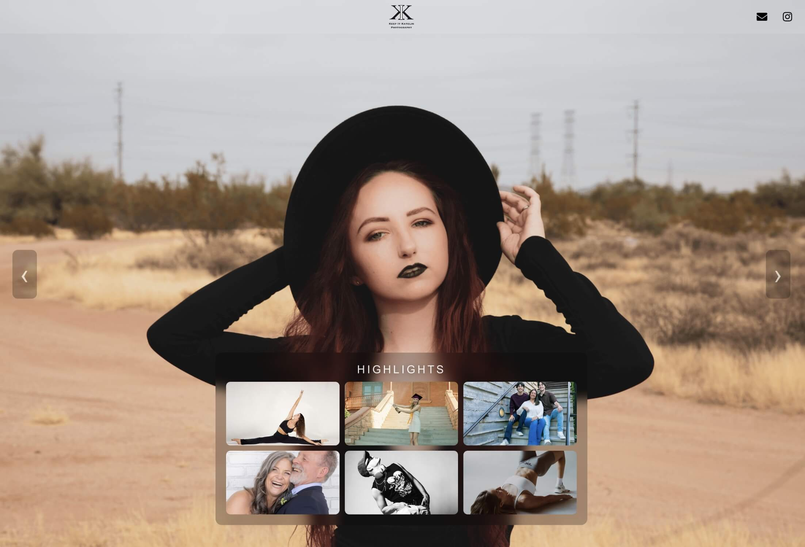
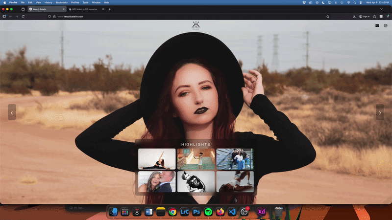

# 📸 Keep It Katelin

A modern, immersive photography portfolio built with **Next.js**, designed to feel less like a website—and more like an experience.

<p align="center">
  
</p>

<p align="center">
  
</p>

<p align="center">
  
  
  
  


---

## 🌐 Live Site

👉 [Keep It Katelin](https://www.keepitkatelin.com)

---

## ✨ Overview

**Keep It Katelin** is a fully responsive photography portfolio that blends performance, motion, and minimal UI to showcase visual work without distraction.

Instead of traditional page navigation, the site uses a **gallery-first experience**:

* Fullscreen cinematic backgrounds
* Smooth gallery transitions
* Modal-based image exploration
* Mobile-first swipe interactions

The goal was simple:

> Let the photography speak—while the UI stays out of the way.

---

## 🎯 Key Features

### 🎞️ Gallery System

* Multiple curated galleries (Highlights, Events, Editorial, Portrait, etc.)
* Seamless switching with animated transitions
* Backgrounds dynamically update per gallery

### ⚡ Performance-Driven Image Handling

* Custom **image preloading + decoding system**
* Idle-time prefetching for adjacent galleries
* Prevents flickering and improves perceived speed

### 📱 Mobile-First Interaction

* Swipe gestures with velocity detection
* Multi-step flick navigation (fast swipe = skip images)
* Touch-safe modal closing logic

### 🖼️ Immersive Modal Viewer

* Fullscreen image viewing
* Keyboard navigation (← → ESC)
* Smooth directional slide animations

### 🎨 Cinematic UI/UX

* Background crossfade with blur + dissolve
* Glassmorphism gallery container
* Subtle motion easing for a premium feel

### 📬 Contact UX

* One-click email copy with toast feedback
* Direct Instagram integration

---

## 🧠 Technical Highlights

### Smart Image Preloading

```js
const preloadAndDecode = (src) => {
  if (!src || decodedCache.has(src)) return;

  const img = new Image();
  img.src = src;

  if (img.decode) img.decode().catch(() => {});
  decodedCache.add(src);
};
```

* Uses `Image.decode()` for smoother rendering
* Avoids layout jank during transitions
* Caches decoded assets to prevent redundant work

---

### Velocity-Based Swipe Detection

```js
const velocity = Math.abs(dx) / dt;
const isFast = velocity > 0.5;
```

* Differentiates between slow drag vs intentional swipe
* Scales navigation steps based on swipe speed
* Creates a natural, app-like interaction model

---

### Background Crossfade System

* Dual-layer background rendering
* Controlled fade state for smooth transitions
* Mobile-specific focal point adjustments

---

## 🛠 Tech Stack

* **Framework:** Next.js (App Router)
* **Frontend:** React
* **Styling:** CSS + Tailwind utilities
* **Icons:** react-icons
* **Deployment:** Vercel

---

## 📁 Project Structure

```bash
/app
  layout.js
  

/components
  Navbar.jsx
  Slider.jsx

/styles
  Slider.css

/public
  /images
```

---

## ⚙️ Getting Started

```bash
npm install
npm run dev
```

Build for production:

```bash
npm run build
npm start
```

---

## 🚀 Deployment

This project is deployed using **Vercel** with automatic CI/CD:

* Push to GitHub → triggers deployment
* Optimized for Next.js out of the box

---

## 💡 Design Philosophy

This project focuses on three core principles:

### 1. Content First

The UI never competes with the photography.

### 2. Motion with Purpose

Animations are subtle, fast, and intentional—not decorative.

### 3. Performance = UX

Preloading, decoding, and transition timing are treated as core features—not afterthoughts.

---

## 🔮 Future Improvements

* Dark / light adaptive UI (in progress)
* CMS integration for dynamic galleries
* Image optimization via Next.js `<Image />`
* Accessibility enhancements (ARIA, focus states)

---

## 👤 Author

**Jean Richardson**
- Frontend Developer & UI/UX Designer

---

## 📬 Contact

* Instagram: https://instagram.com/keepitkatelin
* Email: [kate.richardson410@gmail.com](mailto:kate.richardson410@gmail.com)

---

## ⭐ Final Note

This project is a reflection of how I approach frontend development:

> Clean architecture, intentional UX, and performance-driven design.

If you're viewing this as a recruiter or collaborator—thanks for taking the time.
