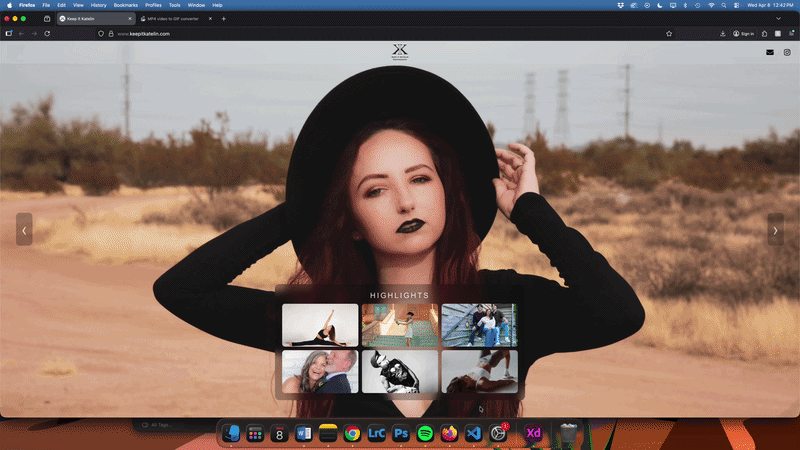

<div align="center">
  <br />

  <p align="center">
  
  </p>

  <h1>📸 Keep It Katelin</h1>

  <p>
    A cinematic photography portfolio, built to feel less like a website and more like an experience.<br/>
    No CMS. No admin panel. Just galleries, motion, and a UI that gets out of the way.
  </p>

  <br />

  <div>
    
    
    
    
    
  </div>
</div>

## 📋 Table of Contents

1. 🤖 [Introduction](#introduction)
2. ⚙️ [Tech Stack](#tech-stack)
3. 🔋 [Features](#features)
4. 🤸 [Quick Start](#quick-start)
5. 🗂️ [Project Structure](#project-structure)
6. 🕸️ [Snippets](#snippets)
7. 🎨 [Design Philosophy](#design-philosophy)
8. 🔮 [Future Improvements](#future-improvements)
9. 📌 [Known Limitations](#known-limitations)

## <a name="introduction">🤖 Introduction</a>

Keep It Katelin is a fully responsive photography portfolio built around a gallery-first experience rather than traditional page navigation — fullscreen cinematic backgrounds, animated gallery transitions, a fullscreen modal viewer, and mobile-first swipe gestures.

The project was built to demonstrate frontend craft where the interface has to disappear: a custom image preloading and decoding layer to kill flicker between galleries, velocity-based swipe detection that distinguishes a lazy drag from an intentional flick, and a dual-layer background crossfade system — all in service of one rule: the photography speaks, the UI stays out of the way.

**🌐 [Live Site → keepitkatelin.com](https://www.keepitkatelin.com)**

## <a name="tech-stack">⚙️ Tech Stack</a>

- **Next.js** (App Router)
- **React**
- **CSS + Tailwind utilities** — hand-tuned transitions rather than off-the-shelf animation libraries
- **react-icons**
- **Vercel** — deployment with CI/CD on push to `main`

## <a name="features">🔋 Features</a>

👉 **Gallery system** — multiple curated galleries (Highlights, Events, Editorial, Portrait) with seamless, animated switching; the background updates per gallery.

👉 **Performance-driven image handling** — a custom preload + decode pipeline with idle-time prefetching for adjacent galleries, so browsing never flickers or stutters.

👉 **Mobile-first interaction** — swipe gestures with velocity detection, multi-step "flick to skip" navigation, and touch-safe modal closing.

👉 **Immersive modal viewer** — fullscreen image viewing with keyboard navigation (← → ESC) and smooth directional slide animation.

👉 **Cinematic UI** — background crossfade with blur + dissolve, a glassmorphism gallery container, and subtle motion easing throughout.

👉 **Contact UX** — one-click email copy with toast feedback and direct Instagram integration.

## <a name="quick-start">🤸 Quick Start</a>

**Prerequisites:** [Node.js](https://nodejs.org/en) and npm.

```bash
git clone <your-repo-url>
cd keep-it-katelin-photography
npm install
npm run dev
```

Open [http://localhost:3000](http://localhost:3000).

Build for production:

```bash
npm run build
npm start
```

## <a name="project-structure">🗂️ Project Structure</a>

```
app/
  layout.js              – root layout
components/
  Navbar.jsx              – site navigation
  Slider.jsx              – gallery slider + modal viewer
styles/
  Slider.css              – gallery, modal, and crossfade styles
public/
  images/                 – gallery assets
```

## <a name="snippets">🕸️ Snippets</a>

<details>
<summary><code>Smart image preloading</code> — decode ahead of render to kill flicker</summary>

Rather than letting the browser decode images on the main thread mid-transition, each upcoming image is preloaded and decoded off-screen and cached so it never has to happen twice:

```javascript
const preloadAndDecode = (src) => {
  if (!src || decodedCache.has(src)) return;

  const img = new Image();
  img.src = src;

  if (img.decode) img.decode().catch(() => {});
  decodedCache.add(src);
};
```

</details>

<details>
<summary><code>Velocity-based swipe detection</code> — distinguishing a drag from a flick</summary>

Touch navigation tracks drag distance over time rather than distance alone, so a fast flick advances further than a slow, deliberate drag — a small detail that makes the gallery feel like a native app instead of a scroll container:

```javascript
const velocity = Math.abs(dx) / dt;
const isFast = velocity > 0.5;
```

</details>

<details>
<summary><code>Background crossfade system</code> — dual-layer transitions</summary>

Two background layers are rendered simultaneously, with a controlled fade state swapping which one is visible — avoiding the pop/flash of a single-layer `background-image` swap, with separate focal-point adjustments for mobile.

</details>

## <a name="design-philosophy">🎨 Design Philosophy</a>

**Content first.** The UI never competes with the photography.

**Motion with purpose.** Animations are subtle, fast, and intentional — not decorative.

**Performance = UX.** Preloading, decoding, and transition timing are treated as core features, not afterthoughts.

## <a name="future-improvements">🔮 Future Improvements</a>

- Dark / light adaptive UI (in progress)
- CMS integration for dynamic galleries
- Image optimization via Next.js `<Image />`
- Accessibility enhancements (ARIA, focus states)

## <a name="known-limitations">📌 Known Limitations</a>

These were deliberate scope decisions, not oversights:

- **No CMS** — galleries are managed in code rather than through an admin panel; content updates require a redeploy.
- **No `next/image` yet** — image optimization is on the roadmap but not yet wired into the preload/decode pipeline.
- **Accessibility is in progress** — keyboard navigation exists in the modal viewer, but ARIA labeling and focus states across the rest of the UI are a planned pass, not yet complete.